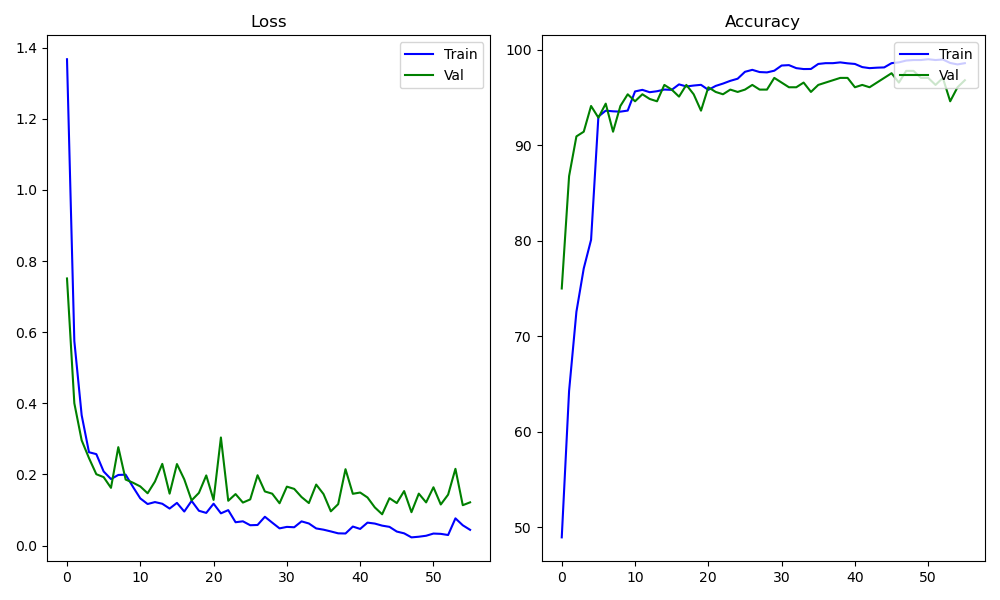

# INF368A Exercise 1

## Task 1
## Task 2

## Task 3
### Architecure / Backbone
The backbone consists of the following:
- 1x (frozen) EfficientNet v2 (using small weights)
- 2x Convolutional layers (with 3x3 kernel) with ReLU activation and batch normalization
- 1x Max pooling layer
- 1x Fully connected layer with ReLU activation
- 1x Drop out layer (p=0.2)
- 1x Fully connected layer

Full specifications can be seen in *backbone.py*. 

### Training
- *Loss function:* Cross entropy loss
- *Optimizer:* Adam
- *Learning rate:* 0.0014
- *Batch size:* 64

The data is split into train (75%), validation (5%) and test data (20%) using a custom data loader. The classifier trains for a maximum of 50 epochs, but has early stopping implemented. All images are resized to 200x200 pixels in the dataloader. All the above parameters can be changed in *configfile.py*.

To train the network, execute *train.py*. The best model is saved to *checkpoints/best.pth* and will be used in the following tasks. Furthermore, a plot showing loss and accuracy for both the train and validation data is saved to *training_plot.png*.

The classifier takes just over 1 minute to train on the selected dataset and early stops during epoch 5.

### Accuracies on test data
*Class accuracies:*
*chainthin:* 97.92%
*darksphere:* 98.82%
*Rhabdonellidae:* 90.18%
*Odontella:* 94.40%
*Codonellopsis:* 97.12%
*Neoceratium:* 96.30%

*Total accuracy:* 96.14%

To evaluate the classifier on test data, run *evaluate.py*. The total accuracy and accuracy for each class will be printed as shown above.

### Embedding
- To compute and save embeddings (activations in the second to last layer) as pickled pandas dataframes, run *embed.py*
- Embeddings are saved in *embeddings_train.pkl*, *embeddings_test.pkl* and *embeddings_unseen.pkl* for train data, test data, and unseen classes, respectively.
- First column is label (index), the rest are activations.

