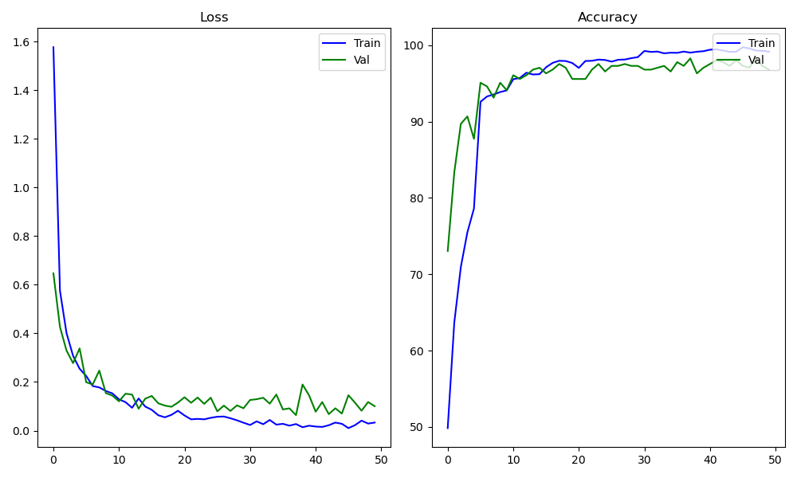
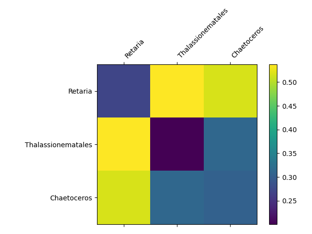

# INF368A Exercise 1
**Odin Hoff Gardå**

## Task 1 and 2
### Seen classes
The following classes (with around 1-2k images each) where used for the train/validation/test data:

- **chainthin:** 1747 images (21.37%).
- **darksphere:** 1704 images (20.85%).
- **Rhabdonellidae:** 1088 images (13.31%).
- **Odontella:** 1140 images (13.95%).
- **Codonellopsis:** 1205 images (14.74%).
- **Neoceratium:** 1290 images (15.78%).

**Total:** 8174 images.

The data is randomly split into the following sets:

- **Training data:** 6144 images.
- **Validation data:** 448 images.
- **Test data:** 1664 images. 

### Unseen classes
The following classes where selected as unseen classes:

- **Retaria:** 1360 images (29.17%).
- **Thalassionematales:** 868 images (18.61%).
- **Chaetoceros:** 2435 images (52.22%).

**Total:** 4663 images.

## Task 3
### Architecure / Backbone
The backbone consists of the following:
- 1x (frozen) EfficientNet v2 (using small weights)
- 2x Convolutional layers (with 3x3 kernel) with ReLU activation and batch normalization
- 1x Max pooling layer
- 1x Fully connected layer with ReLU activation
- 1x Drop out layer (p=0.2)
- 1x Fully connected layer

Full specifications can be seen in *backbone.py*. 

### Training
- *Loss function:* Cross entropy loss
- *Optimizer:* Adam
- *Learning rate:* 0.0014
- *Batch size:* 64

The data is split into train (75%), validation (5%) and test data (20%) using a custom data loader. The classifier trains for a maximum of 50 epochs, but has early stopping implemented. All images are resized to 200x200 pixels in the dataloader. All the above parameters can be changed in *configfile.py*.

To train the network, execute *train.py*. The best model is saved to *checkpoints/best.pth* and will be used in the following tasks. Furthermore, a plot showing loss and accuracy for both the train and validation data is saved to *training_plot.png*.

The classifier takes just over 1 minute to train on the selected dataset and early stops during epoch 5.

### Accuracies on test data
To evaluate the classifier on test data, run *evaluate.py*.

**Test accuracy for each class:**

- **chainthin:** 97.92%
- **darksphere:** 98.82%
- **Rhabdonellidae:** 90.18%
- **Odontella:** 94.40%
- **Codonellopsis:** 97.12%
- **Neoceratium:** 96.30%

**Total test accuracy:** 96.14%

## Task 4 and 5

### How to compute embeddings
To compute and save embeddings (activations in the second to last layer) as pickled pandas dataframes, run *embed.py*. Embeddings are saved as  *embeddings_train.pkl*, *embeddings_test.pkl* and *embeddings_unseen.pkl* for train data, test data, and unseen classes, respectively. The first column is label (index), the rest are activations.

To compute average distances, run *compute_average_distances.py*.

## Average Euclidean distances between classes

The above matrices shows the average Euclidean distances between classes for the test data, and the unseen classes, respectively. For embeddings of the *test data*, we see that the average distance between samples from the same class is significantly smaller than the average distance between samples from different classes. Embeddings of the *unseen* classes however, does not seem to have any such separation.

## Average angular (cosine) distances between classes

For the average angular distances, we observe the same thing as above: the classes our classifier has trained on have good separation (maybe even better than in the Euclidean case), whereas unseen classes seems to be all over the place.

