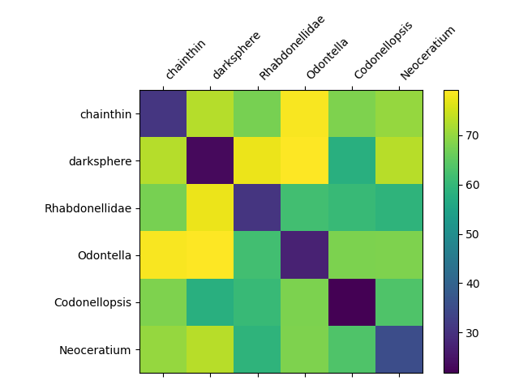
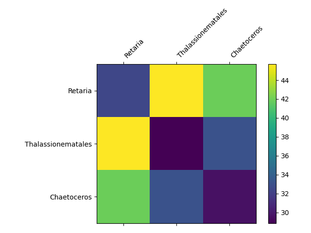
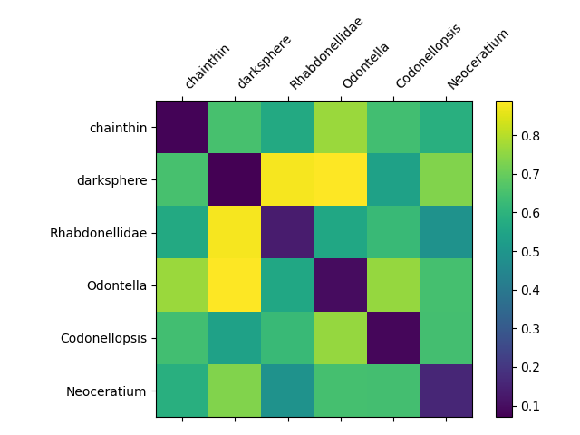
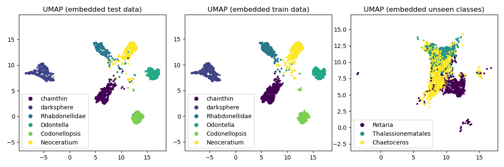
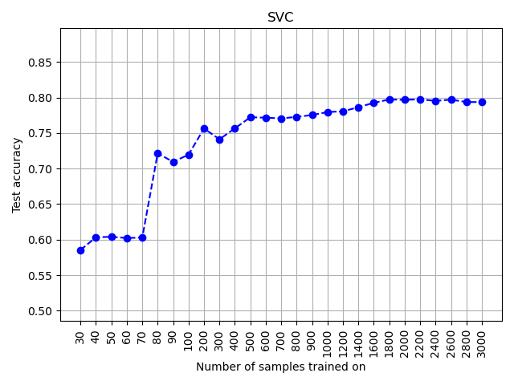
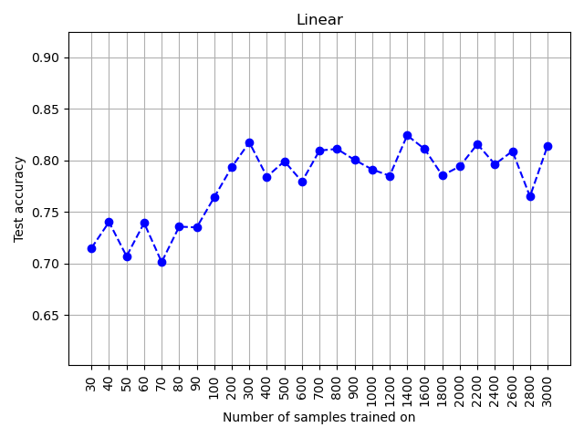
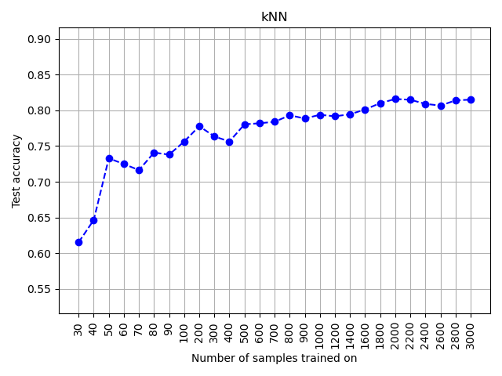

# INF368A Exercise 1
**Odin Hoff Gardå**

## Task 1 and 2
### Seen classes
The following classes (with around 1-2k images each) where used for the train/validation/test data:

- **chainthin:** 1747 images (21.37%). 
- **darksphere:** 1704 images (20.85%). 
- **Rhabdonellidae:** 1088 images (13.31%). 
- **Odontella:** 1140 images (13.95%). 
- **Codonellopsis:** 1205 images (14.74%). 
- **Neoceratium:** 1290 images (15.78%). 

**Total:** 8174 images. 

The data is randomly split into the following sets:

- **Training data:** 6144 images.
- **Validation data:** 448 images.
- **Test data:** 1664 images. 

### Unseen classes
The following classes where selected as unseen classes:

- **Retaria:** 1360 images (29.17%).
- **Thalassionematales:** 868 images (18.61%).
- **Chaetoceros:** 2435 images (52.22%).

**Total:** 4663 images.

## Task 3
### Architecure / Backbone
The backbone consists of the following:
- 1x (frozen) EfficientNet v2 (using small weights) with some layers cut off at the end. 
- 2x Convolutional layers (with 3x3 kernel) with ReLU activation and batch normalization
- 1x Max pooling layer
- 1x Fully connected layer with ReLU activation
- 1x Drop out layer (p=0.2)
- 1x Fully connected layer

```
===============================================================================================                                                                                                                                                                 
Layer (type:depth-idx)                        Output Shape              Param #                                                                                                                                                                                 
===============================================================================================                                                                                                                                                                 
├─Sequential: 1-1                             [-1, 64, 16, 16]          --                                                                                                                                                                                      
|    └─Conv2dNormActivation: 2-1              [-1, 24, 64, 64]          --                                                                                                                                                                                      
|    |    └─Conv2d: 3-1                       [-1, 24, 64, 64]          (648)                                                                                                                                                                                   
|    |    └─BatchNorm2d: 3-2                  [-1, 24, 64, 64]          (48)                                                                                                                                                                                    
|    |    └─SiLU: 3-3                         [-1, 24, 64, 64]          --                                                                                                                                                                                      
|    └─Sequential: 2-2                        [-1, 24, 64, 64]          --                                                                                                                                                                                      
|    |    └─FusedMBConv: 3-4                  [-1, 24, 64, 64]          (5,232)                                                                                                                                                                                 
|    |    └─FusedMBConv: 3-5                  [-1, 24, 64, 64]          (5,232)                                                                                                                                                                                 
|    └─Sequential: 2-3                        [-1, 48, 32, 32]          --                                                                                                                                                                                      
|    |    └─FusedMBConv: 3-6                  [-1, 48, 32, 32]          (25,632)                                                                                                                                                                                
|    |    └─FusedMBConv: 3-7                  [-1, 48, 32, 32]          (92,640)                                                                                                                                                                                
|    |    └─FusedMBConv: 3-8                  [-1, 48, 32, 32]          (92,640)                                                                                                                                                                                
|    |    └─FusedMBConv: 3-9                  [-1, 48, 32, 32]          (92,640)                                                                                                                                                                                
|    └─Sequential: 2-4                        [-1, 64, 16, 16]          --                                                                                                                                                                                      
|    |    └─FusedMBConv: 3-10                 [-1, 64, 16, 16]          (95,744)                                                                                                                                                                                
|    |    └─FusedMBConv: 3-11                 [-1, 64, 16, 16]          (164,480)                                                                                                                                                                               
|    |    └─FusedMBConv: 3-12                 [-1, 64, 16, 16]          (164,480)                                                                                                                                                                               
|    |    └─FusedMBConv: 3-13                 [-1, 64, 16, 16]          (164,480)                                                                                                                                                                               
├─Sequential: 1-2                             [-1, 64, 8, 8]            --                                                                                                                                                                                      
|    └─Conv2d: 2-5                            [-1, 64, 16, 16]          36,928                                                                                                                                                                                  
|    └─BatchNorm2d: 2-6                       [-1, 64, 16, 16]          128                                                                                                                                                                                     
|    └─ReLU: 2-7                              [-1, 64, 16, 16]          --                                                                                                                                                                                      
|    └─Conv2d: 2-8                            [-1, 64, 16, 16]          36,928                                                                                                                                                                                  
|    └─BatchNorm2d: 2-9                       [-1, 64, 16, 16]          128                                                                                                                                                                                     
|    └─ReLU: 2-10                             [-1, 64, 16, 16]          --                                                                                                                                                                                      
|    └─MaxPool2d: 2-11                        [-1, 64, 8, 8]            --                                                                                                                                                                                      
├─Sequential: 1-3                             [-1, 128]                 --                                                                                                                                                                                      
|    └─Linear: 2-12                           [-1, 128]                 524,416                                                                                                                                                                                 
|    └─ReLU: 2-13                             [-1, 128]                 --                                                                                                                                                                                      
|    └─Dropout: 2-14                          [-1, 128]                 --                                                                                                                                                                                      
├─Sequential: 1-4                             [-1, 6]                   --                                                                                                                                                                                      
|    └─Linear: 2-15                           [-1, 6]                   774                                                                                                                                                                                     
===============================================================================================                                                                                                                                                                 
Total params: 1,503,198                                                                                                                                                                                                                                         
Trainable params: 599,302                                                                                                                                                                                                                                       
Non-trainable params: 903,896                                                                                                                                                                                                                                   
Total mult-adds (M): 26.26        
===============================================================================================
Input size (MB): 0.19               
Forward/backward pass size (MB): 2.00
Params size (MB): 5.73     
Estimated Total Size (MB): 7.92
===============================================================================================
```

The model returns activation from the second last layer in its forward pass method so that we can easily extract embeddings later. The model is implemented in `backbone.py`. 

### Training
- *Loss function:* Cross entropy loss
- *Optimizer:* Adam
- *Learning rate:* 0.0014
- *Batch size:* 64

The data is split into train (75%), validation (5%) and test data (20%) using a custom data loader. The classifier trains for a maximum of 50 epochs, but has early stopping implemented. All images are resized to 128x128 pixels in the dataloader. All the above parameters can be changed in `configfile.py`.

To train the network, execute `train.py`. The best model is saved to `checkpoints/best.pth` and will be used in the following tasks. Furthermore, a plot showing loss and accuracy for both the train and validation data is saved to `training_plot.png`.


The classifier takes approximately 1 minute to train on the selected dataset (with early stopping).

### Accuracies on test data
To evaluate the classifier on test data, run `evaluate.py`.

**Test accuracy for each class:**

- **chainthin** 98.51% 
- **darksphere** 99.41% 
- **Rhabdonellidae** 96.88% 
- **Odontella** 98.00% 
- **Codonellopsis** 98.77% 
- **Neoceratium** 94.24% 

**Total test accuracy:** 97.80%

## Task 4 and 5

### How to compute embeddings
To compute and save embeddings (activations in the second to last layer) as pickled pandas dataframes, run `embed.py`. Embeddings are saved as  `embeddings_train.pkl`, `embeddings_test.pkl` and `embeddings_unseen.pkl` for train data, test data, and unseen classes, respectively. The first column is label (index), the rest are activations.

To compute average distances, run `compute_average_distances.py`.

### Average Euclidean distances between classes



The above matrices shows the average Euclidean distances between classes for the test data, and the unseen classes, respectively. For embeddings of the *test data*, we see that the average distance between samples from the same class is significantly smaller than the average distance between samples from different classes. There is also some separation between the embeddings of the *unseen* classes although the two last unseen classes seems more difficult to tell apart based on these average distances. 

### Average angular (cosine) distances between classes



For the average angular distances, we observe the same thing as above: the classes our classifier has trained on have good separation. The last two unseen classes seems to be closer in average angular distance.

## Task 6 and 7
To obtain the plots in this task, run `dimensionality_reduction.py`.

### Dimensionality reduction via UMAP
First, we randomly sample some of the images (~2000) from each of the datasets (train data, test data and unseen classes). Then we compute the embeddings of these points and fit UMAP on them reducing the dimensions from 128 to 2. At last, we plot the output from UMAP for each of the datasets and save the plot to `umap_embeddings.png`. Dimensionality reduction using t-SNE was also tested but was slower and did not give a noticeable better separation. Two dimension was choosen because it is easy to visualise in scatter plots.



We see that the classes the classifier is trained on are well-separated even in 2 dimensions after applying UMAP. This holds true for both the test data and the training data. There seems to be some slight confusion in the test data between *Codonellopsis* and a few other classes. For the unseen classes, we observe some separation, but also some overlap. Especially the third unseen class *Chaetoceros*, overlap with both other unseen classes.

### Close and far-away samples
We compute the center for each class and show the 5 closest images and the 5 furthest away images with respect to the Euclidean distance to their class center. We also find the 5 closest images from other classes. The *first* and *second row* shows the closest and furthest away images within the class, respectively. The *bottom row* shows the closest images from other classes. In this task we use samples from the training data.


## Task 8
To generate accuracy plots for this task, run `transfer_learning.py`. We load the previously computed embeddings of the unseen classes from `embeddings_unseen.pkl` and split this into training (70%) and test (30%) data. Using more and more of the training data, we fit three classifiers and evaluate them on the test data:

- Support Vector Classifier
- Linear Classifier
- kNN Classifier (with k=10)

The following plots show the test accuracy for each classifier with respect to the size of training data used.




